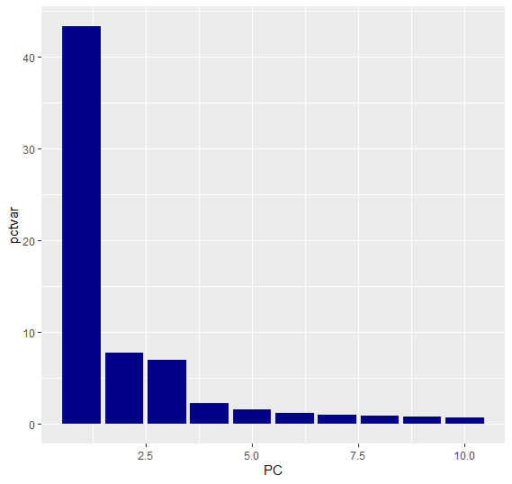
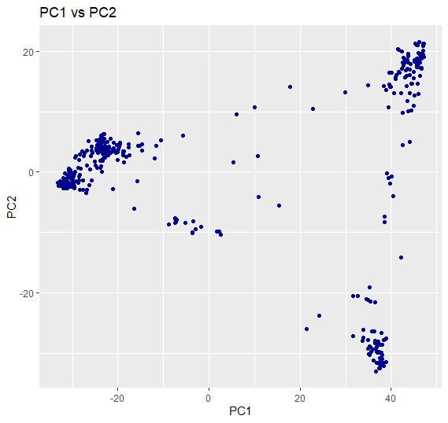
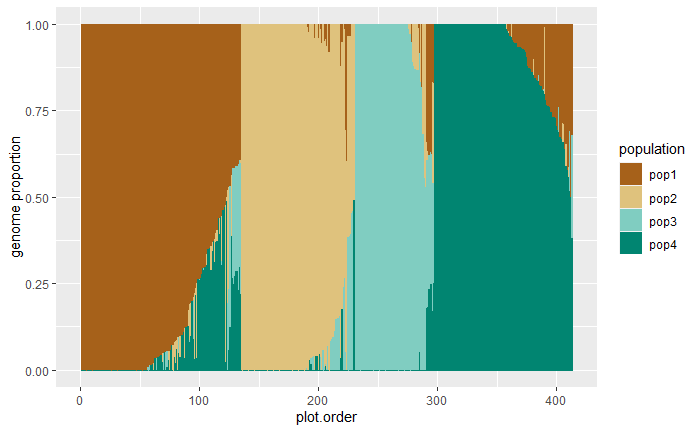
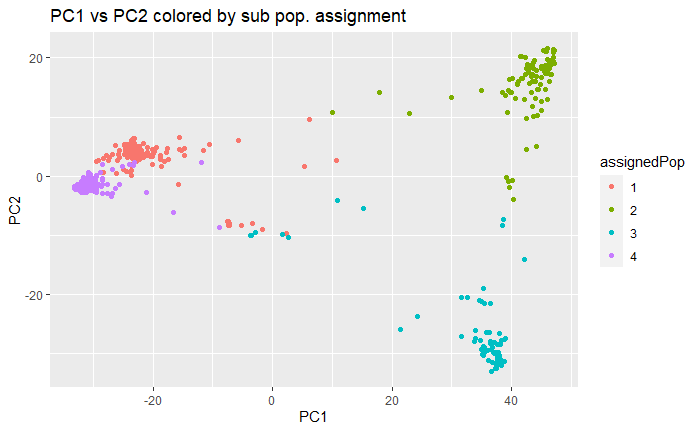

# Rice-PCA-SNPs

Welcome! This repo contains an analysis of SNP data from the RNA sequencing of many rice genomes. This workflow was adapted from the Genomics Laboratory course BIS 180L at UC Davis. This repo contains part of a wider analysis of the rice RNA seq data. More specifically, this repo contains:

* Making PCA and MDS plots from SNP data
* Assigning sub populations using fastStructure
* Exploring the relationship between fastStructure populations and PCA plots

The analyses conducted in this repo of the rice sequencing data will subsequently be used for a GWAS.

### File structure
---

This repo contains 3 directories: `input`, `output` and `scripts`. `input` and `output` contain input and output data to be fed into programs (like fastStructure), and `scripts` contains a .Rmd file with all code used in this analysis and the outputs of it, knitted to html format for viewing. Additionally, `scripts` contains two R scripts: `Rice_SNP_initial.R` and `rice_fastStructure_analysis.R`. The former contains all R used before running fastStructure (ex. format raw data, compute PCs, create PCA and MDS plots), and the latter contains all R used after running fastStruture (ex. assigning sub pops, overlaying pop. assignments with PCA plots.

### Workflow Overview
---

This analysis begins with loading data from a .csv file that contains processed SNP locations derived from a .vcf file, contaning sample information in the left column, with all subsequent columns as genome locations, and column entries as SNPs at those locations. Then:

1. Missing data was filled in with the average genotype
2. Principal components were computed, appended to the data
3. PCA and MDS plots were created, along with a plot showing the variance explained by each PC. These plots are displayed below:

The PCA plots suggested the existence of 3 or 4 sub populations within the data. This SNP data will ultimately be used in a GWAS for certain rice phenotypes (ex. seed length or seed length:width ratio), so _fastStructure_ was used with K=4 sub populations.

1. The genotype, .fam, and .bim files necessary to use fastStructure were created
2. fastStructure was run on _WSL on Ubuntu 20.04_
3. Each sample was assigned to a fastStructure sub population (see plot below)
4. The PCs and fastStructure population assignments were combined
5. New PCA plots colored by population assignment were created (see plot below)

